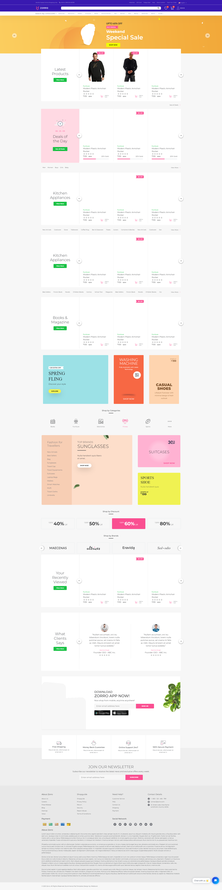

# Bootstrap 5 Responsive HTML Site

## Feel Free To Use & Follow For More Projects :)



## What is this site?
This is a simple E-commerce site.

## Who is it for?
* A simple E-commerce site that will do the trick if you are a front-end developer.
* You are a web developer who wants to learn and create something with the HTML framework.
* Tired of building the same things for every project.
* You want HTML that is simple and easy to understand.
* Your deadline is constrained, you need to provide a prototype to your client at the very least.

## General information

This is a responsive HTML and Bootstrap 5 Responsive HTML with features like;

## Technologies

Project is created with;

* CodeIgniter 3.1.13
* Bootstrap 5.3.1
* Font Awesome 6.4.0
* Owl Carousel 2.3.4
* Jquery 3.7.0
* Bootstrap Bundle Js 5.1.3

## Contributing
I made this HTML, but together we can make it better. There are many ways we can do to make this HTML better:

* Make a suggestion
* Bug report
* Code contribution
* Improve user guide
* Translation

## Cloning the Project

```bash
git clone https://github.com/cengizVenes/ZorroFront.git